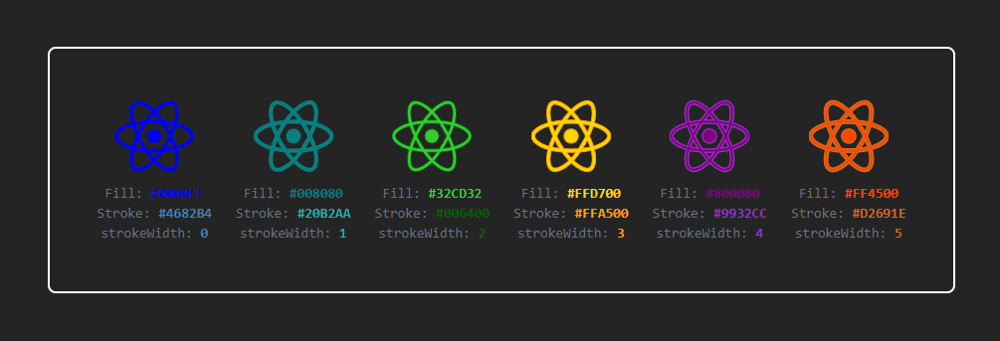
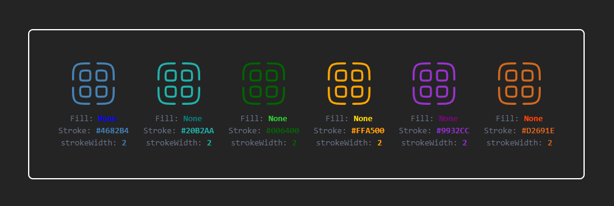

# svg-color-tools

A lightweight utility to dynamically change the `fill`, `stroke`, `stroke-width`, and `className` of SVG strings in JavaScript/TypeScript projects.

## Installation

```bash
npm install svg-color-tools
```

## Usage

```tsx
import { ChangeSvgColor } from 'svg-color-tools';

<ChangeSvgColor
  src="/icons/star.svg" // URL path or local path of the SVG files
  fill="#00f"
  stroke="#333"
  strokeWidth="1.5"
  className="svg-icon"
  style={{ width: 40, height: 40 }}
/>
```

## Example Preview

Here’s a preview showing different colors applied using `ChangeSvgColor`:

#### Fill and Stroke both added :


#### Only Stroke added :


## Props for `ChangeSvgColor`

- `src` (string, required): URL path or local path of the SVG file 
- `fill` (string, optional): Color to apply to `fill` attributes  
- `stroke` (string, optional): Color to apply to `stroke` attributes  
- `strokeWidth` (string, optional): Stroke width to apply  
- `className` (string, optional): Custom class to add to SVG  
- `style` (React.CSSProperties, optional): Inline style for container div  


## License

MIT